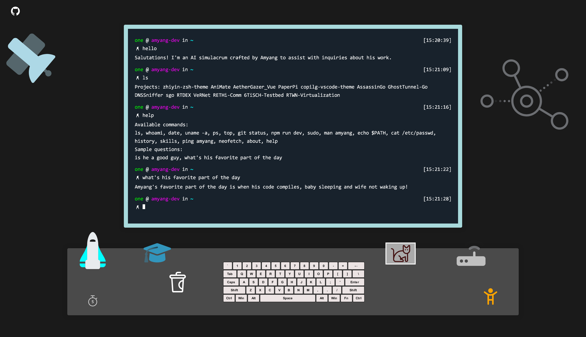

# Amyang's Dev Page

Explore my projects and research with a chatbot. Questions and answers are powered (pre-generated) by Claude 3.5 Sonnet.

https://amyang.dev



## Project Setup

```sh
npm install
```

### Compile and Hot-Reload for Development

```sh
npm run dev
```

### Type-Check, Compile and Minify for Production

```sh
npm run build
```

### Lint with [ESLint](https://eslint.org/)

```sh
npm run lint
```
